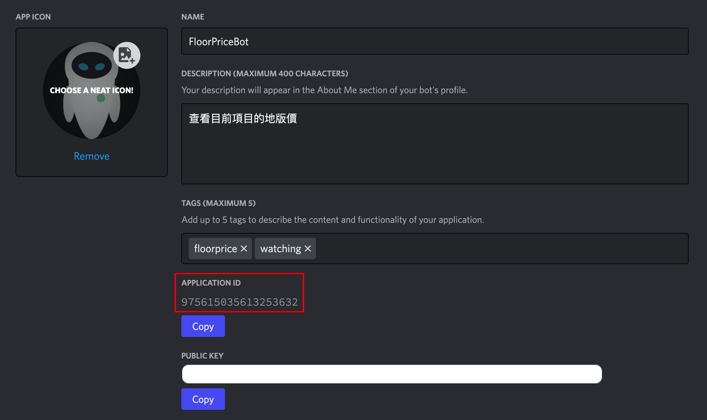

# discord-floor-price-bot

## Demo

### 1. Bot Name


### 2. Command


## Introduction
實作Discord的NFT地板價機器人，持續將最新價格呈現給DC成員看，也可以透過指令查詢地板價，根據需求去使用，簡單幫NFT社群開發自己的功能機器人，提升社群價值

## Function Implement
- [x] 定期更新NFT地板價
- [x] 指令查詢NFT地板價

## First

### Invite own bot app to the Discord
URL example:
https://discord.com/api/oauth2/authorize?client_id=975614035616258632&permissions=0&scope=bot%20applications.commands




## Run

### Compile

```
tsc src/bot.ts
```

### Excute

```
node src/bot.js
```

### Combine

```
tsc src/bot.ts && node src/bot.js
```
or
```
yarn dev
```

## Package
- typescript
- eris
- opensea-scraper
- eth-price

## About

Github：https://github.com/chyiiiiiiiiiiii<br>

Linkedin：https://www.linkedin.com/in/yiichenhi/<br>

Youtube：[Yii](https://www.youtube.com/user/a22601807/videos)<br>
Youtube：[一起饅頭(美食頻道)](https://www.youtube.com/channel/UC8-CcCmlIhIGcs9pdxx_BSw/videos])<br>
Instagram：[yiichenhi](https://www.instagram.com/yiichenhi/)<br>
Email：ab20803@gmail.com<br>
